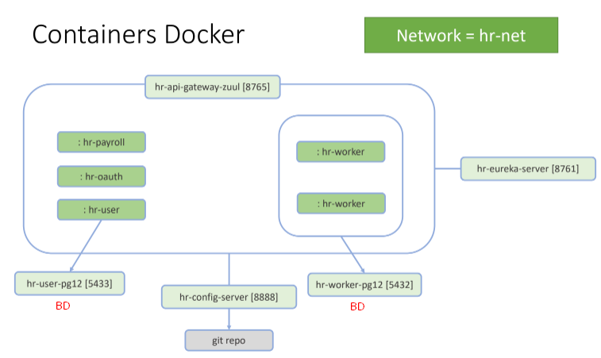

# Criando e testando containers Docker

## Comandos Docker
#### Criar uma rede Docker
```
docker network create <nome-da-rede>
```
#### Baixar imagem do Dockerhub
```
docker pull <nome-da-imagem:tag>
```
#### Construir imagem
```
docker build -f <Dockerfile> -t <nome-da-imagem:tag> .
```
- Não precisa passar o parâmetro **-f** se o arquivo usado for o *Dockerfile* 
#### Listar imagens
```
docker images
```
#### Remover imagem
```
docker rmi <id-da-imagem-1> <id-da-imagem-2>
```
#### Rodar um container a partir de uma imagem
```
docker run -p <porta-externa>:<porta-interna> --name <nome-do-container> --network <nome-da-rede> -e <var-1>=<valor-1> -e <var-2>=<valor-2> <nome-da-imagem:tag> 
```
- Porta externa: porta mapeada para acessarmos o container externamente (da máquina local, browser, etc)
- Porta interna: porta interna no container, esta será mapeada para uma porta externa, permitindo acesso externo


**Para rodar um container autoescalável**
```
docker run -P --network <nome-da-rede> <nome-da-imagem:tag>
```
- Não específicamos nome e porta para o container, pois ele é autoescalável, podendo ter mais de uma instância
- O parâmetro **-P** faz com que o container inicie com uma porta aleatória
- **Para subir mais de uma instância**, basta rodar o comando `docker run -P ...` (descrito acima)

#### Listar containers
```
docker ps
docker ps -a
```
#### Iniciar container
```
docker start <id-do-container>
```
#### Parar container
```
docker stop <id-do-container>
```
#### Remover container
```
docker rm <id-do-container>
```
#### Acompanhar logs do container em execução
```
docker logs -f <id-do-container>|<nome-do-container>
```
------------------------------------------------

## Containers Docker do sistema HR


## Passo a passo para dockerizar sistema HR
#### Criar rede docker para sistema hr
```
docker network create hr-net
```
- Necessário para que os microsserviços possam se comunicar, para isso eles precisam estar na mesma rede.

#### Rodando containers com banco de dados PostgreSQL para os microsserviços hr-worker e hr-user
```
docker pull postgres:12-alpine
docker run -p 5432:5432 --name hr-worker-pg12 --network hr-net -e POSTGRES_PASSWORD=1234567 -e POSTGRES_DB=db_hr_worker postgres:12-alpine
docker run -p 5433:5432 --name hr-user-pg12 --network hr-net -e POSTGRES_PASSWORD=1234567 -e POSTGRES_DB=db_hr_user postgres:12-alpine
```


#### Construindo imagem e rodando container para o microsserviço hr-config-server
*Dockerfile*
```
FROM azul/zulu-openjdk-alpine:11
VOLUME /tmp
EXPOSE 8888
ADD ./target/hr-config-server-0.0.1-SNAPSHOT.jar hr-config-server.jar
ENTRYPOINT ["java","-jar","/hr-config-server.jar"]
``` 
```
mvnw clean package
docker build -t marcosviniciusam90/hr-config-server:v1 .
docker run -p 8888:8888 --name hr-config-server --network hr-net -e GITHUB_USER=marcosviniciusam90 -e GITHUB_PASS=*** marcosviniciusam90/hr-config-server:v1
```

#### Construindo imagem e rodando container para o microsserviço hr-eureka-server
*Dockerfile*
```
FROM azul/zulu-openjdk-alpine:11
VOLUME /tmp
EXPOSE 8761
ADD ./target/hr-eureka-server-0.0.1-SNAPSHOT.jar hr-eureka-server.jar
ENTRYPOINT ["java","-jar","/hr-eureka-server.jar"]
``` 
```
mvnw clean package
docker build -t marcosviniciusam90/hr-eureka-server:v1 .
docker run -p 8761:8761 --name hr-eureka-server --network hr-net marcosviniciusam90/hr-eureka-server:v1
```

#### Construindo imagem e rodando container para o microsserviço hr-worker
*Dockerfile*
```
FROM azul/zulu-openjdk-alpine:11
VOLUME /tmp
ADD ./target/hr-worker-0.0.1-SNAPSHOT.jar hr-worker.jar
ENTRYPOINT ["java","-jar","/hr-worker.jar"]
``` 
```
mvnw clean package -DskipTests
docker build -t marcosviniciusam90/hr-worker:v1 .
docker run -P --network hr-net marcosviniciusam90/hr-worker:v1
```
- Não específicamos nome e porta para o container, pois este microsserviço é autoescalável, podendo ter mais de uma instância
- O parâmetro **-P** faz com que o container inicie com uma porta aleatória
- **Para subir mais de uma instância**, basta rodar o comando `docker run -P ...` (descrito acima)

#### Construindo imagem e rodando container para o microsserviço hr-user 
- Procedimento similar ao do **hr-worker**, só precisa ajustar o nome do arquivo .jar e da imagem docker
#### Construindo imagem e rodando container para o microsserviço hr-payroll
- Procedimento similar ao do **hr-worker**, só precisa ajustar o nome do arquivo .jar e da imagem docker
#### Construindo imagem e rodando container para o microsserviço hr-oauth
- Procedimento similar ao do **hr-worker**, só precisa ajustar o nome do arquivo .jar e da imagem docker

#### Construindo imagem e rodando container para o microsserviço hr-api-gateway-zuul
*Dockerfile*
```
FROM azul/zulu-openjdk-alpine:11
VOLUME /tmp
EXPOSE 8765
ADD ./target/*.jar hr-api-gateway-zuul.jar
ENTRYPOINT ["java","-jar","/hr-api-gateway-zuul.jar"]
```
```
mvnw clean package -DskipTests
docker build -t marcosviniciusam90/hr-api-gateway-zuul:v1 .
docker run -p 8765:8765 --name hr-api-gateway-zuul --network hr-net marcosviniciusam90/hr-api-gateway-zuul:v1
```