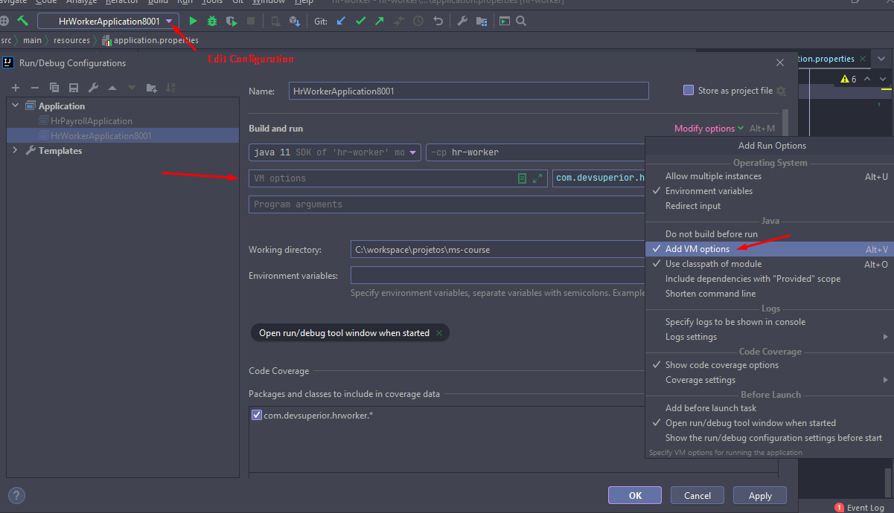
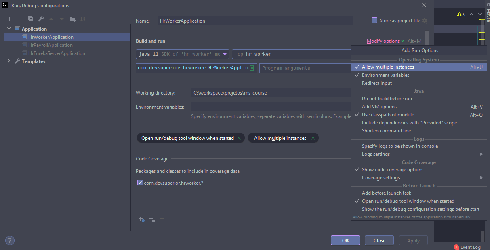

# Configurar IntelliJ para rodar mais de uma instância de uma aplicação

Na configuração da execução da aplicação, habilite o campo **VM options** (conforme imagem abaixo)  

Adicione o comando abaixo mudando a porta que a aplicação irá executar (as aplicações devem ser executadas em portas diferentes)  
`Dserver.port=8001`

 

## Aplicação configurada para executar em porta randômica
application.properties: `server.port=${PORT:0}`   
Quando a aplicação estiver configurada para executar em porta randômica, podemos configurar o IntelliJ para permitir executar múltiplas instâncias da aplicação (conforme imagem abaixo)  

